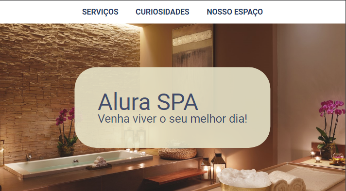

<h1 align="center"> ALURA SPA </h1>

SITE REALIZADO APÓS O ACOMPANHAMENTO DA FORMAÇÃO DE HTML/CSS DO CURSO ALURA.

  <a href="#-tecnologias">Tecnologias</a>&nbsp;&nbsp;&nbsp;|&nbsp;&nbsp;&nbsp;
  <a href="#-projeto">Projeto</a>&nbsp;&nbsp;&nbsp;|&nbsp;&nbsp;&nbsp;
  <a href="#-layout">Layout</a>&nbsp;&nbsp;&nbsp;|&nbsp;&nbsp;&nbsp;
  <a href="#memo-licença">Licença</a>

  

 

  

## 🚀 Tecnologias

Esse projeto foi desenvolvido com as seguintes tecnologias:

- SASS
- Git e Github

## 💻 Projeto

Projeto realizado para inicializar o estudo de SASS

## :memo: Licença

Esse projeto está sob a licença MIT.

---

Feito com ♥ by Arthur Oliveira